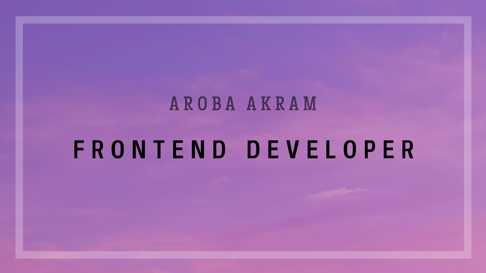

## 👋 Hello, I'm Aroba Akram! 

Welcome to my little corner of GitHub! 👩‍💻

I’m a Front-End Developer with a passion for crafting sleek, responsive, and interactive web experiences. My love for clean code and attention to detail drives me to create user interfaces that aren’t just functional but also beautiful! 🌟

### 🌟 What I Do:
Front-End Development: Proficient in HTML, CSS, JavaScript, and React.
Interactive UI Design: Crafting smooth animations and micro-interactions for an engaging user experience.
Project Highlights: Explore my repositories showcasing projects built with React, Tailwind CSS, and more.

### 🎯 A bit about my journey:
During my chemistry graduation, I discovered my passion for coding, inspired by tools like ChemSketch & ChemDraw. It was then that I decided to dive into web development. I started by learning HTML, CSS, and JavaScript, and as I practiced, my interest grew. Fast forward to today, I’ve leveled up with React, and I'm on a mission to transition into Full-Stack Development while sharing my learning process and experiences along the way. 🚀

### 🌐 Connect With Me:
LinkedIn: [Sharing my journey and insights on React and web development.](https://www.linkedin.com/in/aroba-chemcoder)

Portfolio: [Check out my projects and creative work.](https://www.linkedin.com/in/aroba-chemcoder)

Let’s create something awesome together! 🤝
